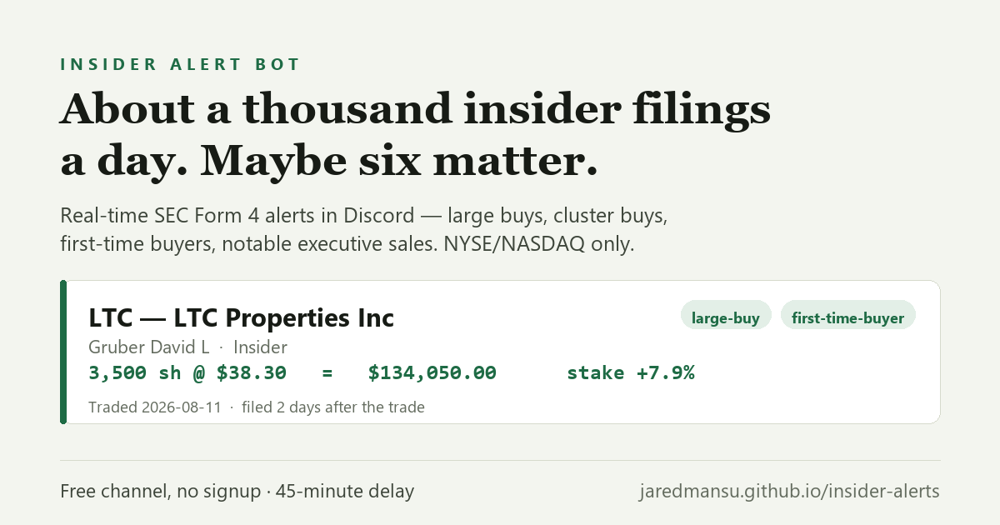

# Insider Alert Bot

Real-time SEC **Form 4** insider-trading alerts, delivered to Discord.

**[Join the Discord →](https://discord.gg/AXSVjJrDWR)** · **[insideralert landing page →](https://jaredmansu.github.io/insider-alerts/)**

When a corporate insider buys or sells their own company's stock, they must file a Form 4
with the SEC. Those filings are public, but they arrive as a firehose of raw XML — hundreds
a day, mostly routine option grants and tax withholding. This bot watches the EDGAR feed
continuously and posts only the trades worth looking at.

## What gets alerted

| Tag | Meaning |
| --- | --- |
| `large-buy` | An insider bought more than $100,000 of stock |
| `cluster-buy` | Two or more insiders bought the same ticker within a week |
| `notable-sale` | An executive sold more than $1,000,000 |
| `first-time-buyer` | First purchase recorded from that insider |

NYSE/NASDAQ only — OTC and unlisted tickers are filtered out.

Each alert shows the ticker and company, the insider and their title, share count, price,
total value, the stake change the trade represents, how many days after the trade it was
filed, whether it was a pre-scheduled Rule 10b5-1 plan sale, and a direct link to the filing
on sec.gov.

## Tiers

- **Free** — every alert, on a 45-minute delay.
- **Premium** — the same alerts the moment they are filed. `/subscribe` in the server.

## Not investment advice

Everything posted is public SEC data, reformatted and filtered. It is not investment advice,
and nobody involved is a licensed financial advisor. Do your own research.

---

This repository holds the landing page. The bot itself is closed source.
